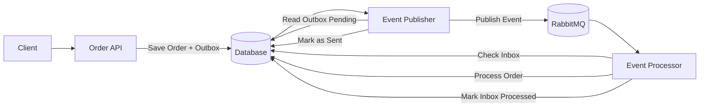

# architecture-lab-event-driven

## 📌 Architecture Overview

This project demonstrates an **event-driven order processing system** using the **Outbox and Inbox Patterns** to ensure reliable message delivery and idempotent processing.

The system is designed around three main components:

- **Order API**: Receives incoming requests and stores both the order and the corresponding event in the database within a single transaction.
- **Event Publisher**: Continuously scans the Outbox table and publishes pending events to RabbitMQ.
- **Event Processor**: Consumes events from the message queue, performs idempotency checks using the Inbox Pattern to prevent duplicate processing, executes the business logic, and updates the order lifecycle within a transactional boundary.

---

## 🔄 Processing Flow

    
1. The client sends a request to create a new order.
2. The API validates the request and stores:
   - The `Order` (with status `Pending`)
   - The `OutboxMessage` (event: `OrderCreated`)
   in the **same database transaction**.
3. The Outbox Publisher periodically reads unsent messages from the database.
4. Each message is published to RabbitMQ and marked as **Sent**.
5. The Order Processor consumes the event from the queue.
6. The order is processed and its status transitions:
   - `Pending → Processing → Completed`
5. The Order Processor consumes the event from the queue.
6. The event is checked against the **Inbox** to prevent duplicate processing.
7. The order is processed and its status transitions:
   - `Received → Processed`
---

## ⚙️ Key Architectural Concepts

- **Event-Driven Architecture**: Services communicate through events instead of direct calls.
- **Outbox Pattern**: Guarantees that no events are lost during the transaction.
- **Inbox Pattern**: Ensures idempotent event consumption and prevents duplicate processing.
- **Asynchronous Processing**: Decouples the API from background processing.
- **Eventual Consistency**: Data is not immediately consistent but becomes consistent over time.

---

## 🎯 Purpose

The goal of this project is to demonstrate how to design a **reliable, scalable, and loosely coupled backend system** using modern architectural patterns commonly found in distributed systems.

